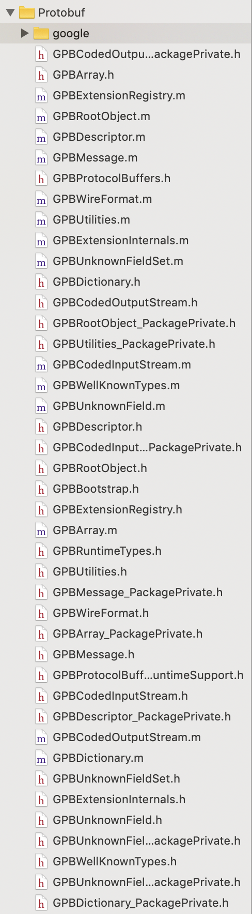

#KerfuSDK集成方式
KerfuSDK可通过CocoaPods和工程引入两种方式集成，若集成方工程的使用了主流的Cocoapods管理，那么恭喜你，集成过程会方便很多，下面分别介绍两种集成方式。
##一、CocoaPods集成
在`Podfile`文件中增加KerfuSDK的pod

```
pod 'KerfuSDK'
```
例如：


版本号不指定可随时更新最新版本，也可指定某一稳定的版本号，然后工程目录进行`pod install`或者`pod update`进行工程workspace的更新后即可在项目中使用KerfuSDK。
##二、在project中直接引入SDK
1.在[KerfuSDK下载页面(内含demo代码)](https://github.com/duihualiu/kerfu.ios.demo/releases )选择最新发布的SDK版本并下载解压，将解压后的文件夹拖入工程，文件布局如下图。


2.引入google的Protobuf，若您的工程已引入Protobuf，请跳过本步骤。
前往[Protobuf](https://github.com/protocolbuffers/protobuf/releases)，选择最新版本的objectivec包下载并解压，将解压后的文件夹拖入工程，文件布局如下图，


google目录展开后如下图，


Protobuf为非ARC模式，所以要将本次引入的所有\*.m文件的编译标识设置为MRC模式，具体步骤为前往工程target下的Build Phases标签下，展开Compile Sources项，并多选所有的Protobuf库的\*.m文件，将其Compiler Flags设置为`-fno-objc-arc`，如图所示，


在对应target的Build Settings中找到User Header Search Path项，并添加您引入的Protobuf文件夹所在的路径，如图。

3.引入FMDB，若您的工程已引入FMDB，请跳过本步骤。
前往[FMDB](https://github.com/ccgus/fmdb/releases),选择最新版本的压缩包下载并解压，将解压后的文件夹拖入工程，文件布局如下图，


4.就此protject中直接引入SDK的工作结束，可以项目代码中使用KerfuSDK了。
##KerfuSDK初始化
使用本框架需要在Naturali平台注册并获取集成app的appId,appKey和appSecret。
引入`KerfuSDK.h`头文件
SDK初始化代码如下：

```
//注册sdk
    [KerfuSDK registerAppId:@"yourAppId"
                        appKey:@"yourAppKey"
                     appSecret:@"yourAppSecret"];
```
在集成方账号体系中的用户登录后，需要将该用户id设置为与本SDK服务器对话的用户id：

```
//设置userId,发送消息的用户id
[KerfuSDK setUserId:@"yourUserId"];
```

SDK需要访问麦克风权限，若您未设置麦克风权限，请在您工程的info.plist文件中增加如下图所示项：


**另:**若您下编译过程中遇到类似下图的编译错误：

静态库中采用ObjectC++实现，因此需要您保证您工程中至少有一个.mm后缀的源文件(您可以将任意一个.m后缀的文件改名为.mm)，或者在工程属性中指定编译方式，即将Xcode的Project -> Edit Active Target -> Build -> GCC4.2 - Language -> Compile Sources As设置为"Objective-C++"。

至此，您可以愉快地使用KerfuSDK了。
