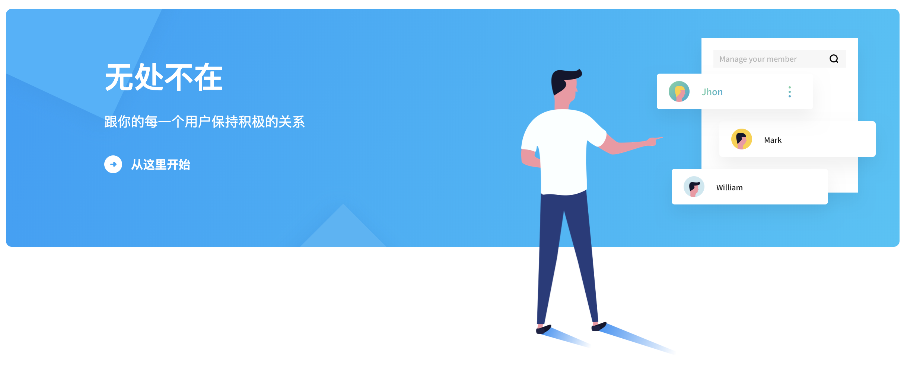

# 对话交互

> 人机交互，从将就机器，到顺从人意

随着技术的平民化，人机交互不可逆转地向人的方向靠近。越来越多的人，可以自然的通过计算设备获得价值。

作为人机交互中唯一不需要学习的主动交互方式，对话交互，可以让人本能通过语言表达、并得到自己想要的，人们：

  - 无需在图形用户界面（GUI）寻找功能入口；
  - 无需遵循界面既定次序，进行严格交互；
  - 可以用不同说法，表述相同语义；
  - 可以直接表述个性化需求。

> “帮我订个酒店，外滩附近，最好可以看到日出” 
>
> “最近天气有点干，推荐一款化妆水给我” 
>
> “从北京飞上海有哪些航班推荐，国航或海航都可以” 
>
> “这款太贵了，推荐一款便宜点的” 
>
> “附近有哪些餐厅，除了海鲜，会过敏”

为了更容易地建立深层次客户关系、提供个性化数字体验、降低运营成本、提高服务效率与质量，越来越多的企业、团队希望将对话交互融入产品。但用户交互行为迥异、用户表达难以泛化、语义转化难匹配、链接逻辑复杂等问题，令开发变得困难。

为了让企业、团队可以轻松地为自己的服务场景开发完整的对话交互，为了让更多用户享受到技术进步带来的流畅体验升级，[Naturali](https://naturali.io/) 将自主研发的语音识别（ASR）、自然语言理解（NLU）、语音合成（TTS）等底层技术隐藏在「对话流™️」开发平台，并通过可视化的操作界面降低开发认知与成本，助力企业打造并维护基于服务场景的对话交互体验。

