1、意图技能

（1）参数配置

**继承参数：**在配置意图技能时，如果存在一些参数适应多个意图技能时，可以将此参数定义至抽象结构中，利用继承参数可以快速继承抽象结构中的参数，省去不必要的重复操作。

**参数列表：**在参数列表中展示了参数标识、此意图所涉及到的实体与缺少实体时机器人主动询问的的追问语句，可以进行增、删、改、查操作。

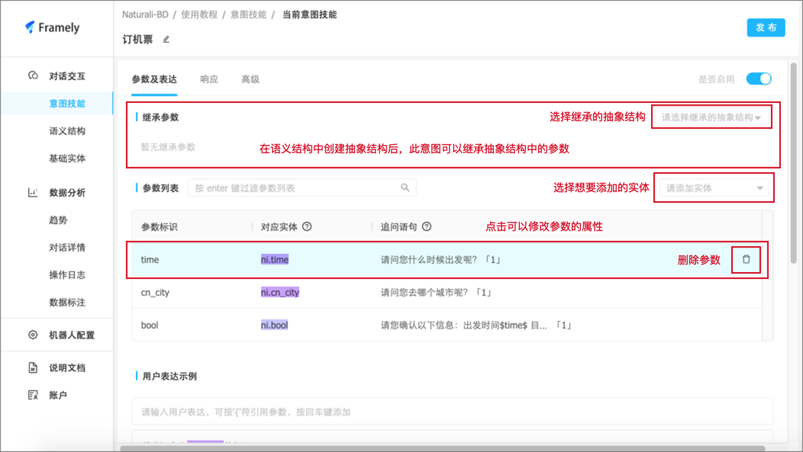

（2）参数标识

**允许多值**：在某些场景中，用户会同时对一种实体中的多个元素有需求。勾选允许多值后，机器人就会将此实体中的多个元素都记录下来，并反复追问用户还有没有需求，直到用户表达没有后追问下一个实体或是结束意图。

多值追问语句写法：请问您{还}需要什么呢？

从第二次追问开始会显示“还”字。

**允许不确定值：**针对此实体的回答，允许不明确、含糊的信息，如：不知道、随便、都行等。

**允许确认：**实体填槽后，在询问下一个实体前，会对此实体的值进行确认。如果确认则追问下一个实体或是结束意图，如果不确认可以直接修改。

**允许追问：**当用户表达中从未包含此实体中的内容时，会使用追问语句进行追问。

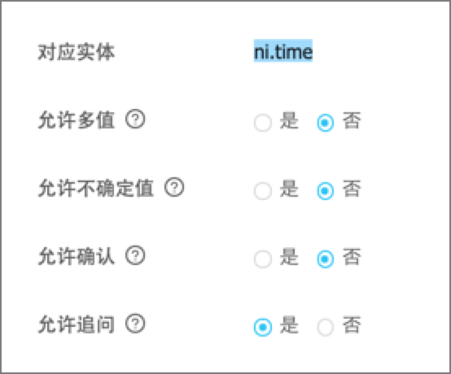

**追问语句：**触发追问后机器人追问用户时使用的话术。

**相关参数：**“相关参数”表示绑定在该参数上，可以表示参数额外特征的参数。

**回答示例：**bool实体和符合实体的追问可以设置回答实例，用于区分用户的肯定或否定回答。

（3）用户表达与小意图配置

**用户表达示例：**当用户的问题中涉及到示例的内容时，机器人回识别并进入此意图，同时主动发送追问语句。用户表达示例可以添加和删除。

**小意图：**切换主意图与小意图。

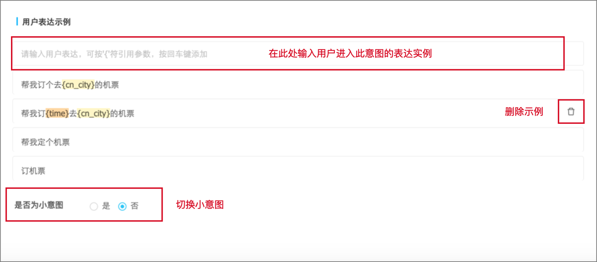

（4）响应配置

**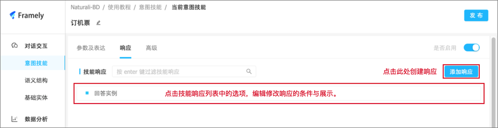技能响应：**当前意图在某一条件下完成后机器人给予用户的回复。

**响应条件：**根据意图中参数的不同状态，组成响应的条件。

- **非空输入：**表示用户表达过程中提到过该实体中的任意值并填槽。默认值为任意值，不可更改。

- **存在于：**表示用户表达过程中提到设定的值中的任意一个或多个值。

- **未提及：**表示用户表达过程中从未提到过该实体中的任意值。

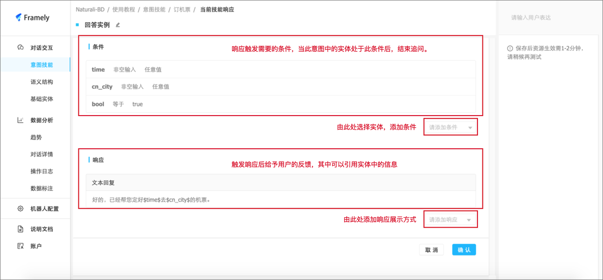

**响应：**触发响应后给予用户的反馈，响应有多种展现形式。

**文本、图片、卡片回复：**设置回复的话术、图片或是卡片的形式展示响应信息。

**文本列表、图片列表、卡片列表回复：**以列表的形式展示。

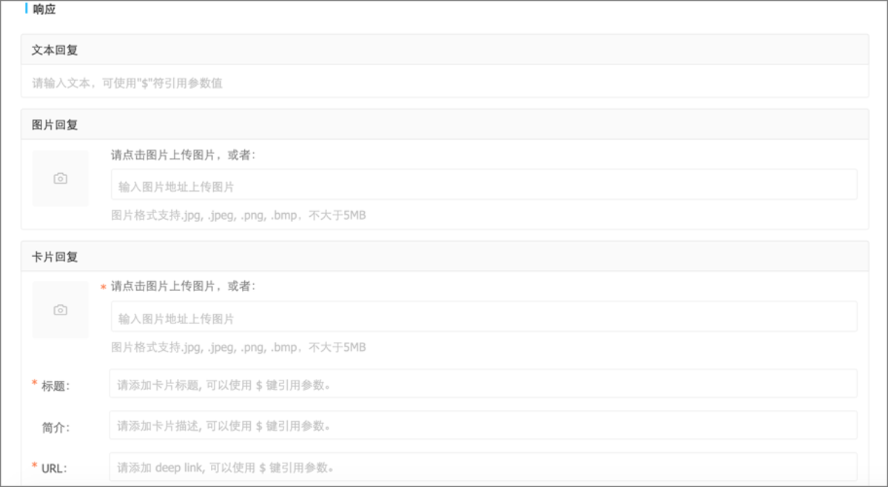

**web****hook回复：**如果您想使用更多的响应方式或者其他响应内容，可以使用WebHook URL配置。

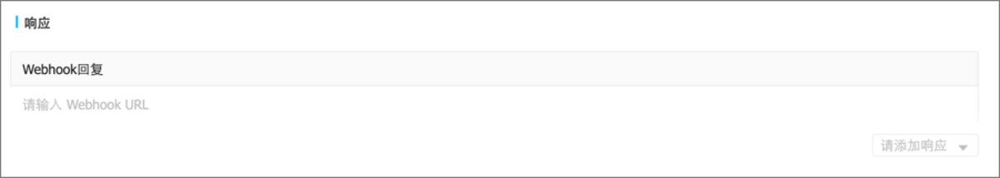

**参数赋值：**如果满足此响应的全部条件，则可以设置给选定的参数赋值。

**参数追问：**在此意图结束后，对选定的参数进行追问。

**清除参数值：**在此条件下结束意图后，会清除选定的参数值。

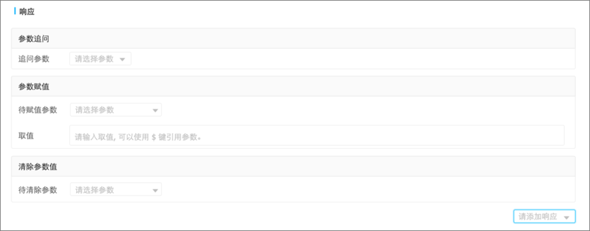

（5）高级配置

**数据查询：**机器人配置中添加数据库后，可以在数据查询模块中配置查询数据。

**SQL/GraphQL+-：**在机器人设置中连接数据库后，在数据查询中选择数据库，输入查询指令后即可进行数据查询。

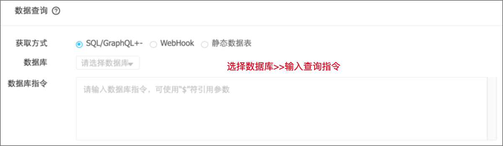

**WebHook：**输入数据获取目标的URL进行数据查询。

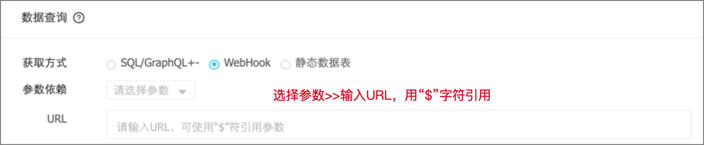

**静态数据表：**上传.csv文件即可添加静态数据表，根据数据所在的坐标进行数据查询操作。

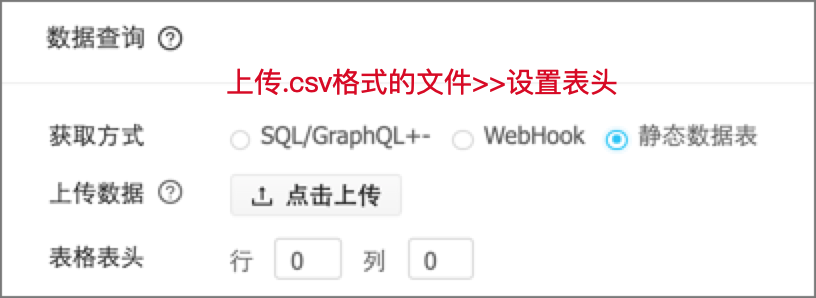

**参数值推荐**：在机器人对实体进行追问时，发送追问语句的同时会对参数值进行推荐，列出选项辅助用户选择或回复参数值。

**输入语境：**使此意图在承接上一意图时才会被触发，表示设置了触发的前置条件。

**实体标签：**用于缩小参数的匹配范围。例如参数A本来的类型是“城市”，若给意图设置了标签“一线城市”“旅游城市”，那么相当于A的类型是“一线城市”“旅游城市”的集合，不满足标签的城市实体不能匹配。

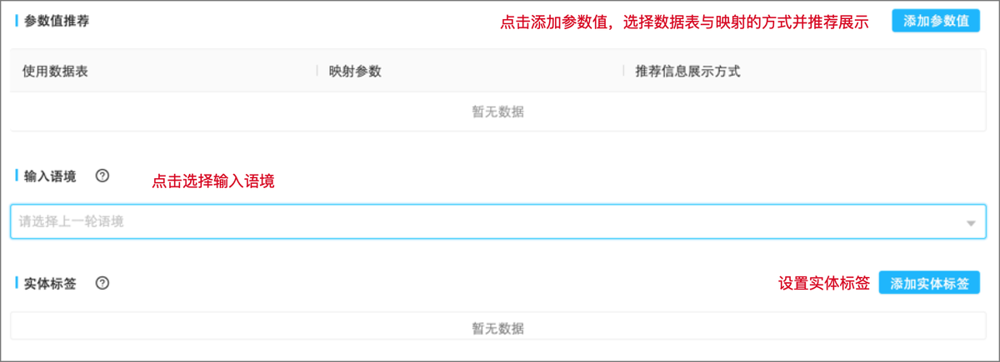

2、语义结构

（1）创建语义结构

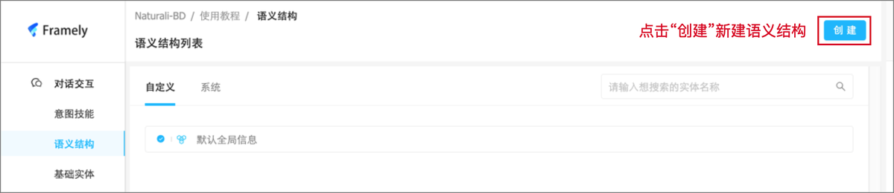

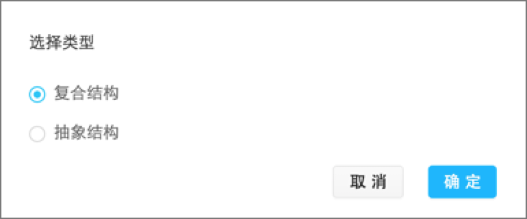

（2）配置操作

语义结构配置操作参考意图技能

3、基础实体

（1）系统实体

系统实体是系统自带的实体可以在意图技能中直接调用，但是不可直接编辑，点击复制图标，可以直接将系统实体复制到自定义实体列表中，实体内容可在自定义实体列表中编辑。

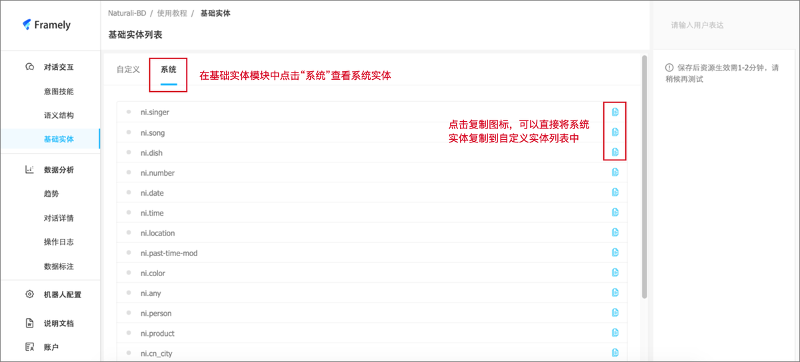

（2）自定义实体

创建实体：根据机器人识别的需要创建自定义实体。

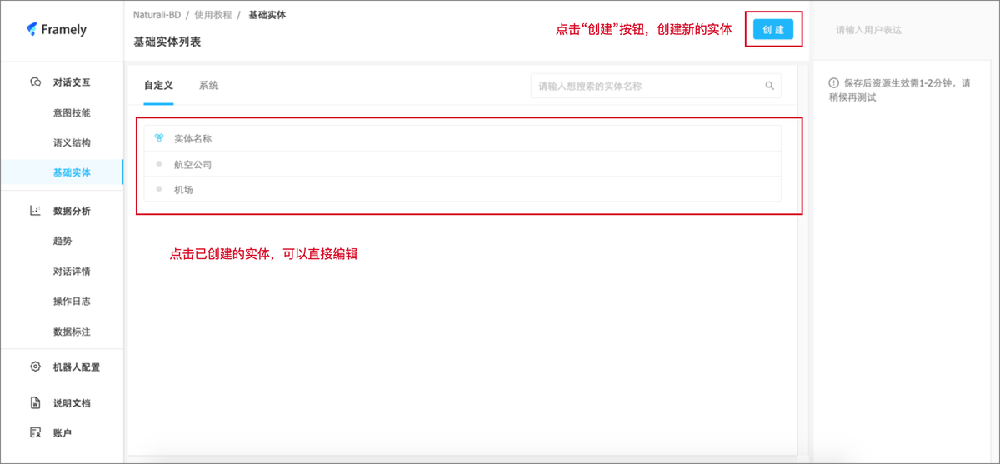

编辑实体内容：

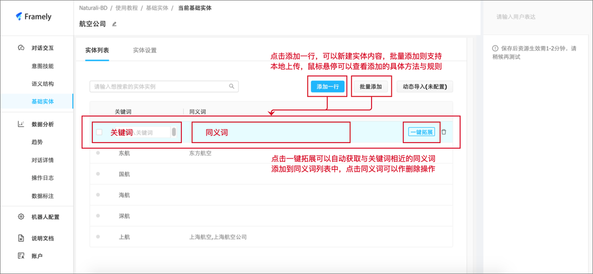

实体设置：

**实体别名：**用户表达话术中命中实体名称时，会将该实体的全部元素填槽，因此当用户本意想要命中实体名称时，就需要丰富实体名称的近义词。

**包含于基础实体：**如果某个实体中的元素包含一个或多个实体的全部元素时，可以设置从属关系高效操作。

**e.g.** “商圈”“街道”“省”“市”“县”都包含于“地点”，则可以设置他们包含于实体“地点”。“地点”包含基础实体 “商圈”“街道”“省”“市”“县”。

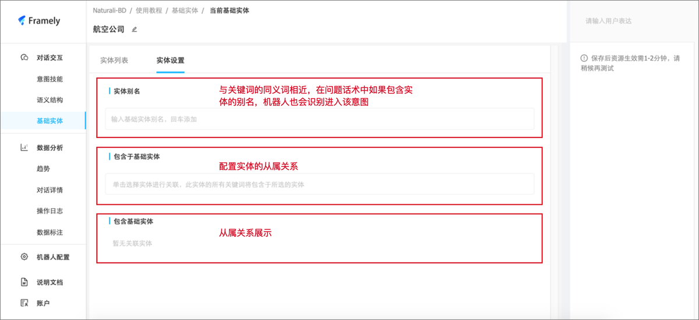

