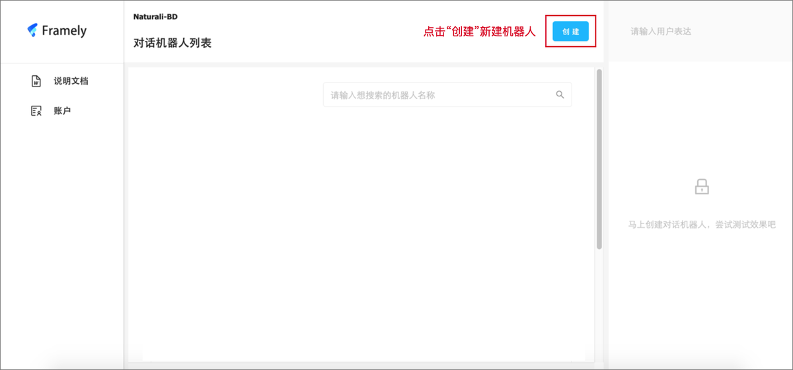
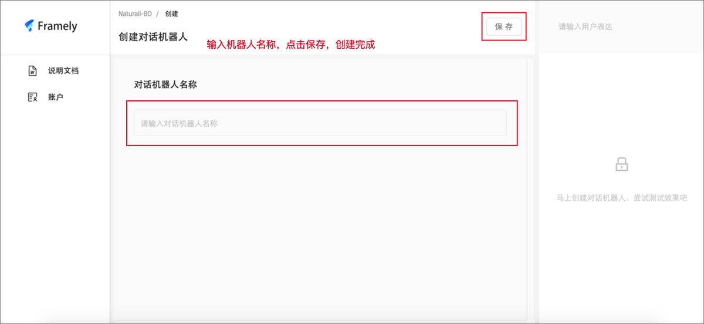
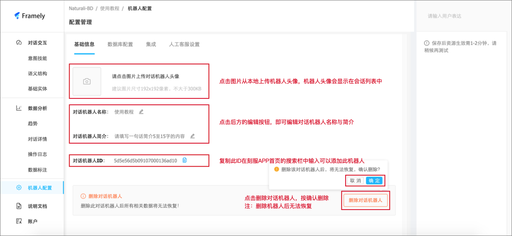
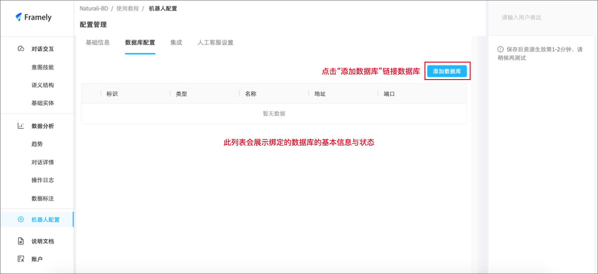
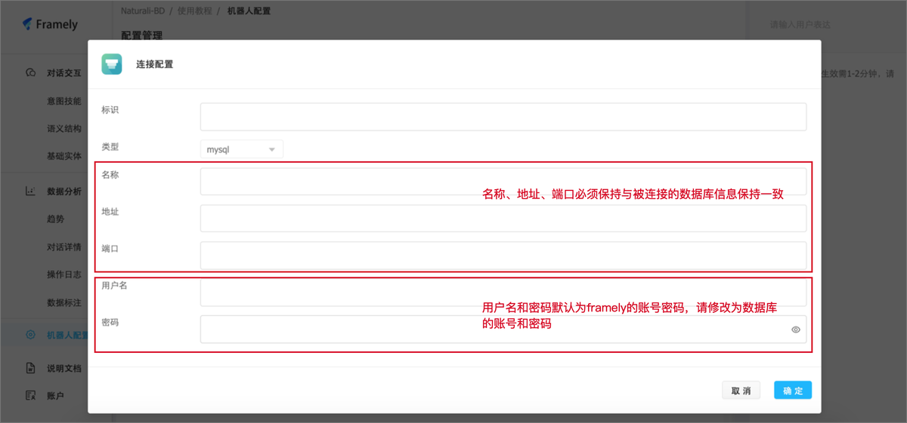
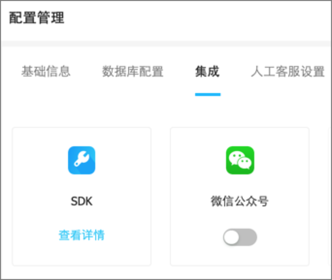
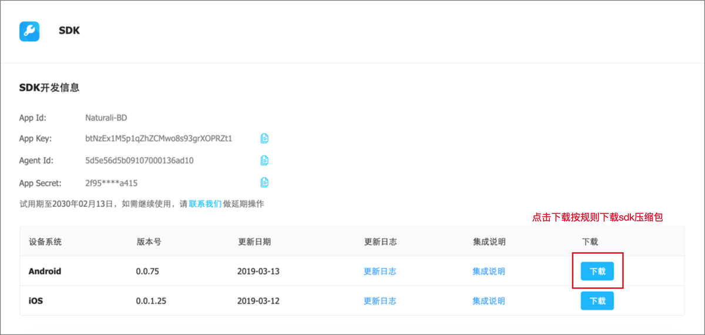
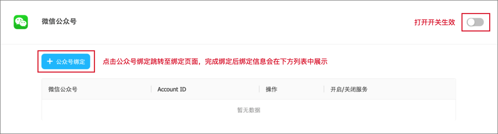
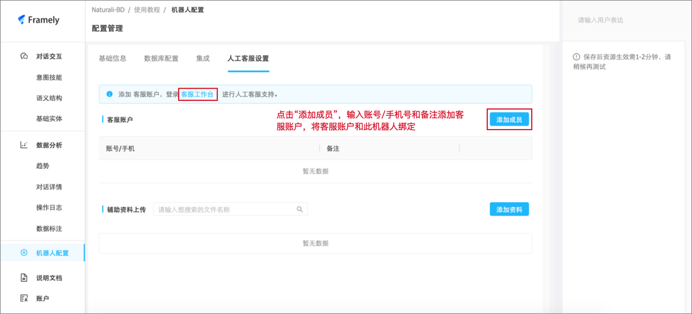

1、基本操作

（1）创建机器人

登陆成功后，点击创建，输入想要创建的机器人名称，即可创建机器人，任意页面点击左上角“Framly”logo即可回到创建机器人页面，下方列表中显示您已经创建的机器人。

（2）修改信息

机器人的头像、名称、简介可以直接编辑修改，如果您想删除机器人，请点击下方的“删除对话机器人”按钮（删除后不可恢复）

2、数据连接配置

在这个模块，我们可以给机器人绑定数据库，在意图技能响应的数据查询中输入查询语句即可调用数据库中的内容。

3、集成

（1）SDK

具体集成方法，可以参见“说明文档-集成-SDK”

（2）微信公众号

4、人工客服配置

首先要添加人工客服账号/手机，完成后可以点击客服工作台，跳转至客服端注册登录登录，使用本平台对使用者问题进行人工回复。

