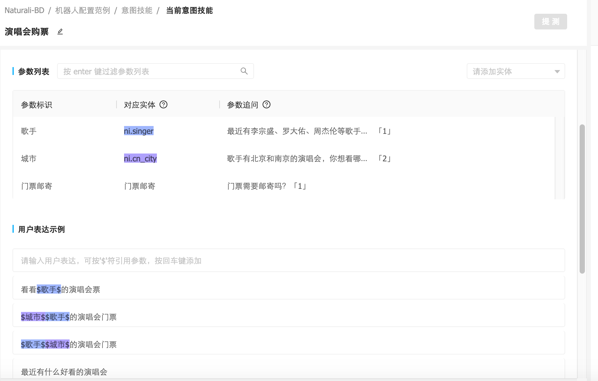
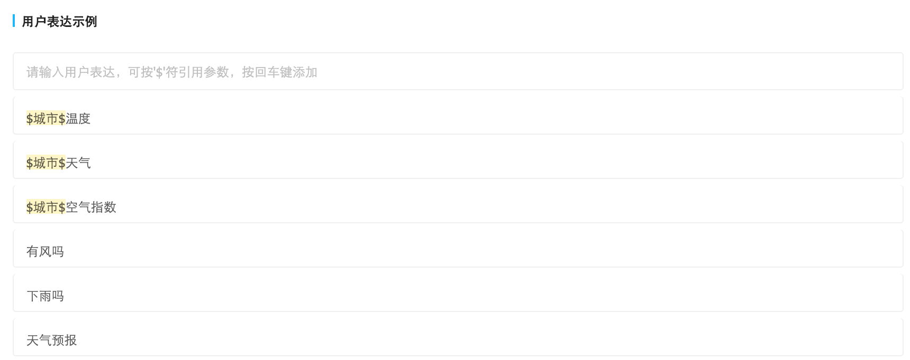
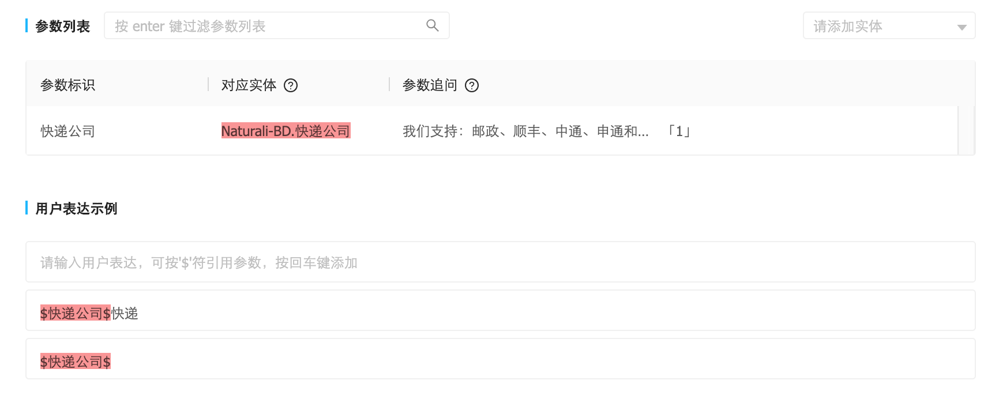

#机器人配置范例

我们根据场景和业务复杂度，配置了三个机器人。您可根据真实的使用场景，选择性参考。

- [**范例1：系统基础实体 ➕ 一个技能响应**](#1)
- [**范例2：系统基础实体 ➕ 多个技能响应**](#2)
- [**范例3：自定义基础实体 ➕ 复合结构**](#3)

### <h2 id="1">范例1：系统基础实体 ➕ 一个技能响应</h2>

场景：查天气。

最终目的：通过城市、日期，查天气。

配置：基础实体+一个技能响应。

模拟对话场景：

> 用户：天气预报
>
> 答：你想查询哪个城市的天气？
>
> 用户：上海
>
> 答：你想查询上海哪一天的天气？
>
> 用户：一月八日
>
> 答：好的，马上帮您查询一月八日上海的天气。

###1）创建意图技能“查天气”。

页面点击左侧导航栏“意图技能”，选择上方导航栏的“创建”，输入名称“**查天气**”即可。

###2）配置实体参数列表

对于“查天气”场景可能需要的信息是：城市、日期。考虑到城市对应的基础实体是：ni.cn_city；日期对应的基础实体是：ni.date。那么我们首先可以把需要的基础实体添加到参数列表内，只需点击“请添加实体”，找到对应实体，确认引用即可。（如图 1-1）

**（图 1-1）**

此时我们的参数列表，就已经包含“**ni.cn_city**”、“**ni.date**”。（如图 1-2）

**（图 1-2）**

点击“ni.cn_city”进入详情，可以进行更详细的设置。

这里我们先忽略“允许多值”、“确认不确定值”、“允许确认”等信息。

我们只需要给参数标识起一个可识别的名字“城市”，并为此参数设置追问语句（追问语句指：某个参数的信息缺失时，我们向用户发起的，针对于此参数的询问）。

在查天气的场景里，我们就可以把针对“城市”的追问设置为“**你想查询哪个城市的天气？**”

（如图 1-3）

**（图 1-3）**

接下来，我们点击“ni.date”进入关于“日期”的详细设置页面。

同上，这个页面的我们也只需要配置参数标识名字和追问语句。

不同的是，在这里我们对追问语句进行一些更人性化的设定，可以看到我有两个追问语句，第二个追问语句有“$城市$”的信息。

它呈现给用户的效果是，当我们已经得到了“城市”的信息，比如“北京”，那么用户看到的询问就会是“你想查询北京哪一天的天气？”。也就是说“$城市$”就是得到的“城市”信息，并且会自动替换。

这部分的具体配置方法是：在第一条追问语句后，“Enter”键进入下一行，正常输入追问语句，在需要替换的参数处，使用英文符号“$”，就会自动出现参数列表，点击引用即可。（如图 1-4）

**（图 1-4）**

###3）配置技能响应

点击**响应**-**添加响应**，进入技能响应配置页面。

为此技能响应起一个可识别的名字。

假设我们只有得到了“城市”和“日期”的信息才能得到技能响应，那么我们就需要添加参数“城市”、“日期”。

选择一种回复方式，这里我们暂时选择文本回复，并添加内容“好的，马上帮您查询$日期$$城市$的天气。”此处使用了“$日期$$城市$”，同参数列表，这里也是通过英文符号“$”调出参数列表，选择自己需要的参数引用。如用户表达了城市“北京”，日期“一月三日”，那么收到的回复就是“好的，马上帮您查询一月三日北京的天气。”

**（图 1-5）**

###4）用户表达示例

4）用户表达示例

好的，我们已经设置了这个技能需要的参数和响应。接下来，我们需要模拟用户的表达，来定义一些用户表达示例，使用户的表达与查天气的意图能够顺利匹配上。

针对“查天气”的场景，假设用户可能的表达如下：

> 天气预报
>
> 北京天气
>
> 北京一月三日天气
>
> 下雨吗
>
> 有风吗
>
> …...

这时，我们把这些添加到用户表达示例里即可，注意这里的“周杰伦”和“周五”需要与参数列表的“歌手”、“日期”一一对应。（如图 1-6）

**（图 1-6）**

### 

### <h2 id="2">**范例2：系统基础实体 ➕ 多个技能响应**</h2>

场景：查天气。

最终目的：既可以通过城市、日期查天气，也可以只通过城市默认查询当天的天气。

配置：基础实体+多个技能响应。

模拟对话场景：

> 用户：看下天气预报
>
> 答：你想查询哪个城市的天气？
>
> 用户：上海
>
> 答：好的，这就帮你查询上海今天的天气。

###1）参数列表的信息同**范例1**

###2）为“查天气”添加另一种可能的技能响应

比如正常情况下，普通用户如果表达“北京天气”，我们认为他是想查看北京今天的天气。

那么此时，我们就可以再添加一个技能响应，起一个可识别的名称。选择唯一的必要参数“城市”，并添加对应的文本回复“好的，这就帮你查询$城市$今天的天气。”（如图 2-1）

**（图 2-1）**

###3）添加用户表达实例

此时我们针对“城市-天气”的技能响应，可以再添加一些用户表达示例。（如图 2-2）

> $城市$ 天气
>
> $城市$ 空气指数
>
> $城市$ 温度
>
> …...



**（图 2-2）**

### <h2 id="3">**范例3：自定义基础实体 ➕ 复合结构**</h2>

场景：演唱会购票。

最终目的：通过歌手、城市、邮寄门票等信息为用户提供演唱会购票服务。

配置：自定义基础实体 + 复合结构 + 一个技能响应。

模拟对话场景：

> 用户：最近有什么好看的的演唱会吗
>
> 答：最近有李宗盛、罗大佑、周杰伦等歌手的演唱会。请问您想看谁的？
>
> 用户：李宗盛吧
>
> 答：李宗盛有北京和南京的演唱会，你想看哪个城市的？
>
> 用户：都可以
>
> 答：门票需要邮寄吗？
>
> 用户：需要
>
> 答：我们支持：邮政、顺丰、中通、申通和韵达快递。请问你方便接收哪个快递公司的快件？
>
> 用户：邮政
>
> 答：好的，已经帮你预定$歌手$的演唱会门票。请及时填写地址信息，我们会在购票成功后尽快寄出。

###1）创建意图技能“演唱会购票”。

###2）自定义基础实体

对于“演唱会购票”场景可能需要的参数信息是：**歌手、城市、快递公司**。

其中歌手、城市可以分别用系统基础实体“ni.singer、ni.cn_city”实现。

而快递公司，这个基础实体在系统中不存在，此时就可以用自定义基础实体来实现。

定义基础实体**快递公司**：邮政、顺丰、中通、申通、韵达

步骤：左侧导航栏——基础实体——自定义——创建——命名——添加关键词及同义词

页面效果（如图 3-1）

**（图 3-1）**

###3）复合结构定义

模拟对话场景中，有一个关于“**门票需要邮寄吗？**”的问题，且如果回答是肯定的，还需要继续询问“我们支持：邮政、顺丰、中通、申通和韵达快递。请问你方便接收哪个快递公司的快件？”，关系图如下（图3-2）

**（图 3-2）**

这种面临是否（布尔）选择的问题，可以通过**复合结构**来解决。创建一个复合结构勾选“无继承”。

命名“门票邮寄”，并在参数列表添加刚刚自定义的实体“快递公司”，为其添加追问语句“我们支持：邮政、顺丰、中通、申通和韵达快递。请问你方便接收哪个快递公司的快件？”。

之后再用户表达示例，如“邮政”，就可以了。（如图 3-3）

**（图 3-3）**

###4）参数列表的信息

目前，演唱会购票技能所需要的参数信息：**门票邮寄（复合结构）、歌手（ni.singer）、城市（ni.cn_city）**，都已配置完成，我们只需在意图技能页面，分别添加三个实体和其对应的追问即可。

回头再看刚刚的场景中有一个问题：“李宗盛有北京和南京的演唱会，你想看哪个城市的？”，“**都可以**”。

针对于这种允许用户不回答准确答案的信息。我们可以在参数详情里进行设置，在“**允许不确定值**”处，勾选“是”。（如图 3-4）

**（图 3-4）**

###5）配置技能响应

这里需要两个技能响应：**需要邮寄、不需要邮寄**。

需要邮寄：选择条件“**歌手、城市、门票邮寄=true**”，并添加文本回复：好的，已经帮你预定$歌手$的演唱会门票。请及时填写地址信息，我们会在购票成功后尽快寄出。（如图 3-5）

**（图 3-5）**

需要邮寄：**选择条件“歌手、城市、门票邮寄=false**”，并添加文本回复：好的，已经帮你预定$歌手$的演唱会门票。出票会会给您发短信确认取票地点。（如图 3-6）

**（图 3-6）**

###6）添加用户表达实例

最后，我们需要模拟用户的表达，来定义一些用户表达示例，使用户的表达与演唱会购票的意图能够顺利匹配上。

针对“演唱会”的场景，假设用户可能的表达如下：

> 买演唱会门票
>
> 最近有什么好看的演唱会
>
> 看看周杰伦的演唱会
>
> 买周杰伦的演唱会门票
>
> 北京最近的演唱会
>
> …...

这时，我们把这些添加到用户表达示例里即可，注意这里的“周杰伦”和“北京”需要与参数列表的“歌手”、“城市”一一对应。（如图 3-7）

**（图 3-7）**

