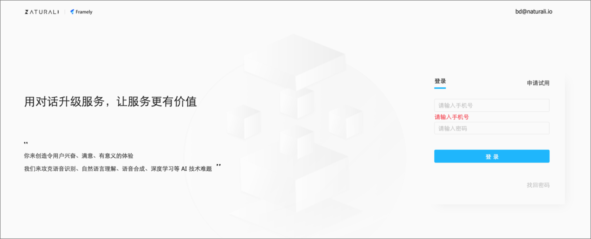
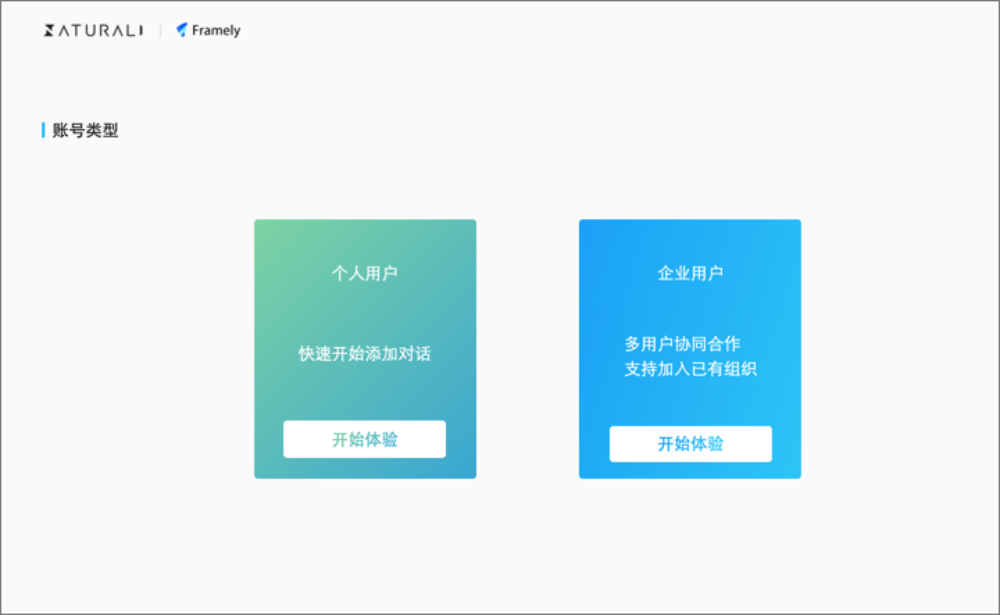
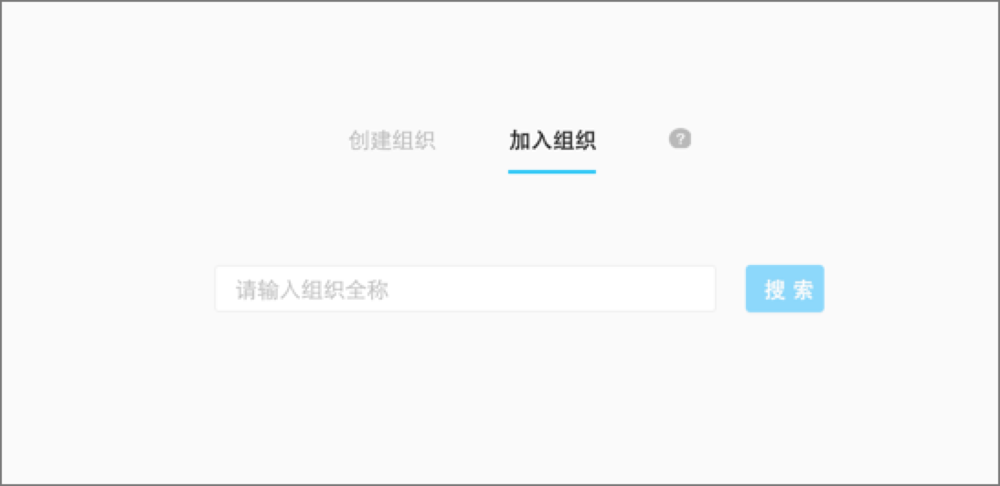
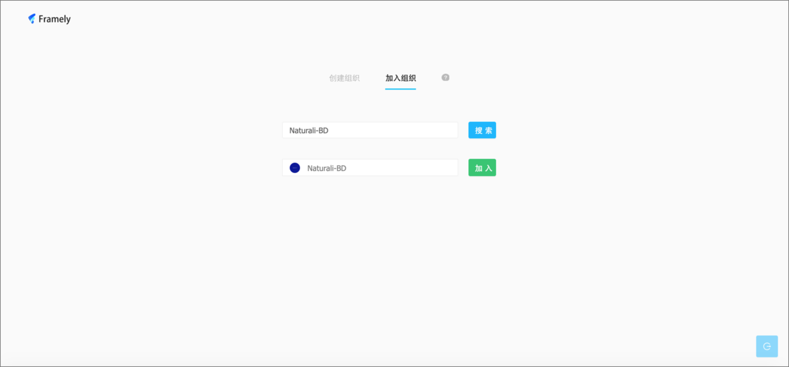

## 注册

从浏览器搜索[https://console.naturali.io/](https://console.naturali.io/) 进入Framely登录主页，点击申请试用，输入注册信息创建账号，密码会在后台随机生成，注册后请凭注册账号与工作人员联系获取初始密码，输入创建的账号和密码登录系统。

## 登录

登录系统后，选择您所开通的账号类型

个人用户：可以编辑对话流，在系统中自定义添加对话。

企业用户：多用户协同合作，支持加入已有的组织，具有个人用户的全部功能。

企业用户在加入组织时，需输入正确的组织全称，点击搜索查询组织。

搜索到合适的组织后，点击加入即可提交申请，管理员同意后刷新界面，即可直接登录企业用户平台。

